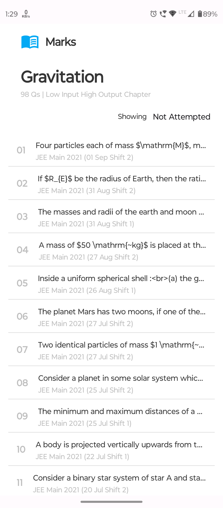

# QuizApp 🤖

This is an Basic QuizApp based on the Figma screens and JSON data.
The app first lists a set of questions which are available in the JSON file. User can tap on a single question to view it's details and attempt it.

[Figma Design](https://www.figma.com/file/ZFp2GEv5Q26aqp7PrrKt36/Android-Development-Task)

## Features 
- Shows Loading effect whenever app loads data (Uses facebook shimmer library)
- Stores Record of Attempted and Unattempted Questions locally in device storage (using room library for this purpose)
- App is purely Built-in kotlin hence concise syntax
- Loads Latex Syntax using MathJax

## Screenshots
       

[Video Demo](https://photos.app.goo.gl/fQ2PrBrJjyEfgpTW9)

### Library and Dependencies Used 🔗
- Facebook Shimmer library
- Gson library for JSON parsing
- Navigation Components
- Room Library
- Material Design 3
